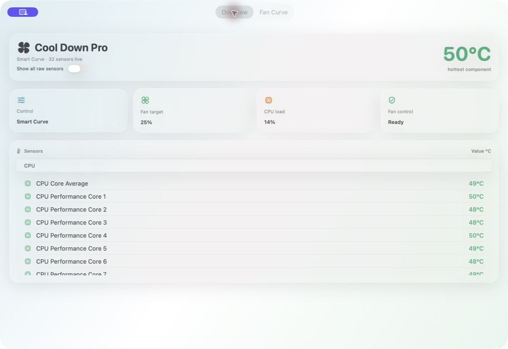

# Cool Down Your Mac

Dual-product macOS menu bar utilities:

- **Cool Down Pro** — independent distribution with SMC fan control, privileged helper, smart curves, and notarized releases
- **Cool Down** — Mac App Store edition that monitors thermal pressure and helps quit hot processes (no fan writes)

## Requirements

- macOS 14+
- Xcode 15+
- [XcodeGen](https://github.com/yonaskolb/XcodeGen) (`brew install xcodegen`)

## Generate & build

```bash
xcodegen generate
open CoolDownYourMac.xcodeproj

# or
xcodebuild -project CoolDownYourMac.xcodeproj -scheme CoolDownPro -configuration Debug build
xcodebuild -project CoolDownYourMac.xcodeproj -scheme CoolDownStore -configuration Debug build
```

Release packaging:

```bash
./Packaging/scripts/build-release.sh
```

See [Docs/DISTRIBUTION.md](Docs/DISTRIBUTION.md) for notarization and App Store steps.

## Screenshots

### Cool Down Pro — Overview



### Cool Down Pro — Smart Fan Curve


## Architecture (Pro)

```
CoolDownPro.app  --XPC-->  Privileged Helper  --IOKit-->  AppleSMC
                     SmartCurveEngine (temp → fan %)
```

## License

This project is licensed under the [GNU General Public License v2.0 only](LICENSE).
