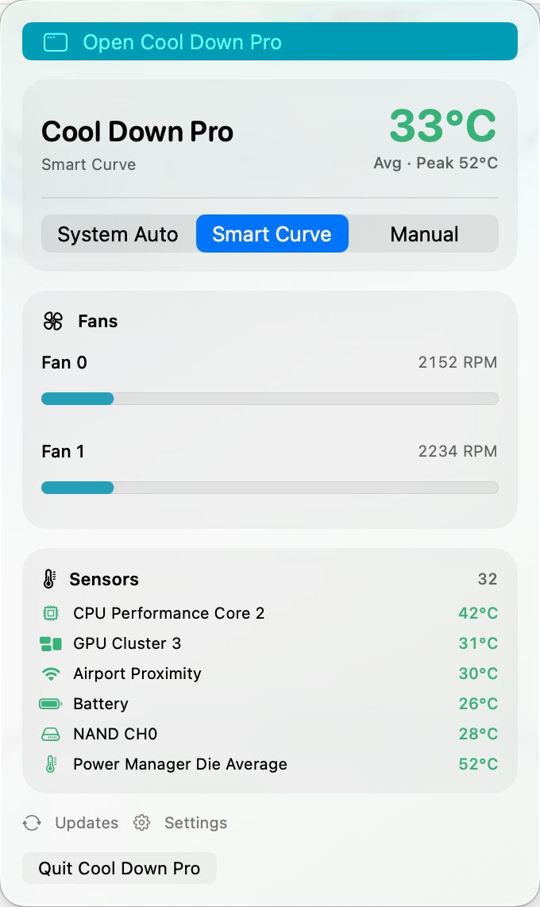
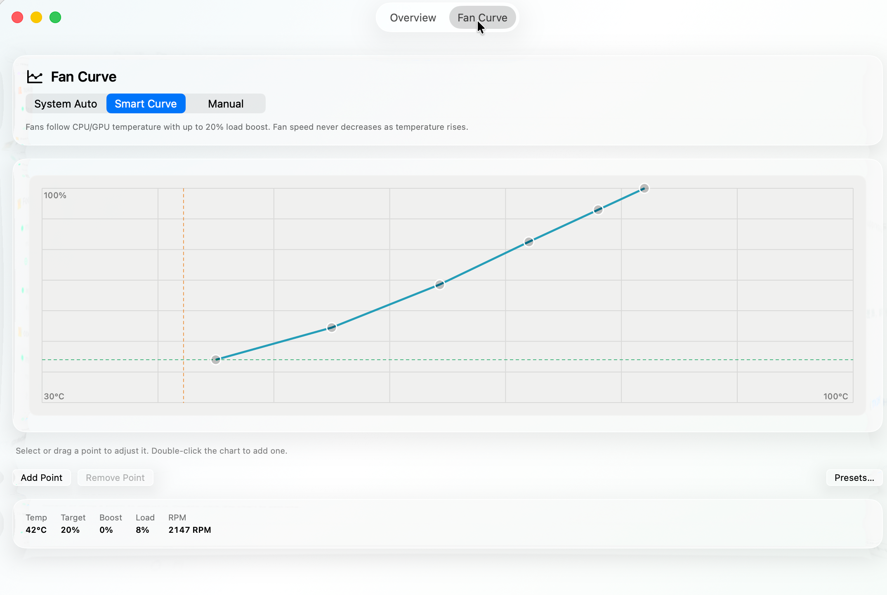

# Cool Down Pro

**Smart, acoustic-aware thermal fan control for macOS without the annoying fan hunting or constant ramp-up / ramp-down cycle.**

[](https://github.com/mammut001/cool-down-your-mac/releases/latest)
[](https://github.com/mammut001/cool-down-your-mac/releases/latest)
[](https://github.com/mammut001/cool-down-your-mac/releases/latest)
[](https://github.com/mammut001/cool-down-your-mac/releases/latest)
[](LICENSE)

### [⬇️ Download the latest notarized DMG (Universal Binary)](https://github.com/mammut001/cool-down-your-mac/releases/latest/download/CoolDownPro.dmg)

Cool Down Pro is a high-performance native macOS menu bar utility that combines direct Apple SMC fan control with filtered thermal signals, transient micro-burst suppression, and an asymmetric smart control curve. Instead of violently reacting to every 200ms single-core thermal spike, it models real physical heat accumulation through hysteresis, asymmetric EWMA low-pass filtering, cooldown hold timers, and sustained emergency overrides.

[**Release Notes**](https://github.com/mammut001/cool-down-your-mac/releases/latest) · [Fan Control Safety Audit](Docs/FAN_CONTROL_AUDIT.md) · [Performance Benchmarks](Docs/PERFORMANCE.md) · [Distribution Guide](Docs/DISTRIBUTION.md) · [Privacy](Docs/PRIVACY.md) · [License](LICENSE)

<p align="center">
  
</p>

---

## Why Cool Down Pro?

Traditional fan control utilities map instantaneous sensor readings directly to fan speeds:

```text
micro-burst workload → single-core temp spikes → fans scream → core idles → fans slam down → repeat
```

On modern multi-core processors—especially **Apple Silicon (M1–M5)** and **Intel Core/Xeon Macs**—individual CPU performance cores frequently experience **sub-second micro-bursts** to 90°C–100°C when launching an app, rendering a web page, or compiling a file.

Because a single core junction is microscopic (a fraction of a square millimeter), its thermal mass is virtually zero. However, your Mac's aluminum chassis, copper heat pipes, and heatsink fins have **thousands of times greater thermal mass**. Blasting the fans at 5,700 RPM on a 200ms core spike does **zero cooling for the chassis**, while creating jarring fan whining and user anxiety.

**Cool Down Pro solves this at the algorithmic level:**
1. **Transient Micro-Burst Suppression**: Filters momentary single-core spikes so fans remain calm and composed.
2. **Sustained High-Heat Protection**: If heat persists for ≥3.5 seconds or filtered die temperature crosses safety thresholds, airflow spools up decisively to combat thermal saturation.
3. **Contextual Clarity**: The menu bar and popover header display the die average temperature alongside an `Avg · Peak XX°C` indicator when an individual core spikes, matching what your hands actually feel on the Mac.

---

## Key Features

### 🌪️ Smart Curve Engine

<p align="center">
  
</p>

* **Asymmetric Thermal Smoothing**: Fast spool-up when heat is sustained, deliberately gradual spool-down (`0.75%/s`) to prevent thermal bouncing.
* **Transient Spike Suppression**: Sub-second core spikes never falsely trigger emergency fan howling.
* **Built-in Curve Presets**:
  * **Default (Balanced)**: Calm acoustic profile for everyday productivity and quiet office environments.
  * **Intel Anti-Throttle (Aggressive Cooling)**: Tuned specifically for high-TDP Intel MacBooks (initiating 65% airflow at 65°C and 100% at 78°C) to prevent thermal throttling before heat-soak.
* **Hysteresis & Cooldown Hold**: Prevents fan hunting around inflection points; holds cooling for 10 seconds post-load.

### 🍎 Comprehensive Hardware Support (Apple Silicon & Intel)
* **Universal Fat Binary**: Native slices compiled for both `arm64` (Apple Silicon) and `x86_64` (Intel).
* **Apple Silicon Sensor Fusion**: Blends `IOHIDEventSystem` with direct AppleSMC registers for per-core P/E cluster and GPU die monitoring.
* **Intel Mac "Furnace" Telemetry**:
  * Hexadecimal core indexing (`TCAC`–`TCFC`) for 10-core iMacs and up to 16/28-core Xeon iMac Pro / Mac Pro systems.
  * Curated monitoring for Intel Platform Controller Hub (`TN0D`), GPU heatsink (`Th1H`), Integrated GPU (`TCGC`), and CPU System Agent (`TCSA`).
  * Faster rise alpha (`0.50` vs `0.35`) on x86_64 to immediately counter rapid Intel Turbo Boost thermal spikes.

### ⚡ Ultra-Low Overhead Telemetry (<0.3% CPU)
* **50%+ Lower Polling Footprint**: Routine sampling reads ~75 curated CPU/GPU keys instead of 250+ keys, cutting sample latency to ~2.4ms.
* **Native Cell-Based `NSTableView`**: Uses an AppKit native table with differential row reloading in the dashboard instead of heavy SwiftUI view hierarchy recomposition.
* **Zero Background Render Waste**: UI updates are completely suspended when the dashboard is minimized or popover is closed.
* **Kernel Timer Coalescing**: 200ms timer tolerance allows macOS to coalesce wakeups and preserve battery life.

### 🔐 Security & Integration
* **Privileged Helper Boundary**: Fan writes execute through an isolated helper installed via `SMJobBless` with Apple Developer ID signing and Hardened Runtime.
* **Sparkle 2 Updates**: Seamless in-app updates cryptographically signed with EdDSA keys.

---

## Control Modes

| Mode | Description |
| :--- | :--- |
| **System Auto** | Hands full fan speed control back to the native macOS SMC thermal management firmware. |
| **Smart Curve** | Custom user-defined fan curve with asymmetric low-pass filtering, hysteresis, load boost, and sustained emergency failsafe. |
| **Manual** | Precise user-selected manual fan percentage slider. |

## Fan Control Safety Audit

Version 1.0.20 adds a 45-second helper lease that returns fans to macOS automatic control when the app stalls or exits. Stale temperature data no longer keeps Manual or Smart Curve active. Failed fan writes trigger rollback and watchdog retries, and manual control is blocked until the installed helper supports leases. Sleep and wake handling restores automatic control before sleep and waits for fresh sensor data after wake.

The audit passed 93 unit tests and live recovery checks on an M5 Pro with two fans, including app pause, force quit, sensor outage, and a 293-second system sleep/wake cycle. Intel runtime behavior and physical AppleSMC fault injection remain unverified. See the [full fan control safety audit](Docs/FAN_CONTROL_AUDIT.md) for the test matrix and limits.

---

## Architecture

```text
┌────────────────────────────────────────────────────────┐
│                    CoolDownPro.app                     │
│  MenuBar · Dashboard (NSTableView) · Curve Editor UI   │
└──────────────────────────┬─────────────────────────────┘
                           │
                 Telemetry Polling Tick
                           ▼
┌────────────────────────────────────────────────────────┐
│                   Sensor Sampling                      │
│     Direct AppleSMC  +  IOHIDEventSystem Client        │
│          (~75 Curated Keys · ~2.4ms latency)           │
└──────────────────────────┬─────────────────────────────┘
                           │ Raw Temperatures
                           ▼
┌────────────────────────────────────────────────────────┐
│                  SmartCurveEngine                      │
│  - Asymmetric EWMA Filter (Rise α=0.35/0.50, Fall α)  │
│  - Sustained Emergency Hold (≥3.5s at ≥90°C)          │
│  - Curve Interpolation + Load Boost + Hysteresis       │
│  - Slew-Rate Limiter (Normal/Warm/Hot rise rates)      │
└──────────────────────────┬─────────────────────────────┘
                           │ Target Fan %
                           │ (XPC Protocol)
                           ▼
┌────────────────────────────────────────────────────────┐
│             Privileged Helper Daemon                   │
│        com.cooldown.CoolDownPro.PrivilegedHelper       │
│             (SMJobBless · Root Authority)              │
└──────────────────────────┬─────────────────────────────┘
                           │ IOKit SMC Call
                           ▼
┌────────────────────────────────────────────────────────┐
│              AppleSMC Hardware Controller              │
│                 Fans & Thermal Registers               │
└────────────────────────────────────────────────────────┘
```

---

## Requirements

* **macOS 14.0 (Sonoma)** or later
* **Hardware**: Apple Silicon (M1/M2/M3/M4/M5) or Intel Core/Xeon Mac
* **Xcode 15+** (for building from source)
* **[XcodeGen](https://github.com/yonaskolb/XcodeGen)**

Install XcodeGen via Homebrew:

```bash
brew install xcodegen
```

---

## Build from Source

Generate the Xcode project and open it:

```bash
xcodegen generate
open CoolDownYourMac.xcodeproj
```

Or build and run all tests from the command line:

```bash
# Run unit test suite
xcodebuild test -scheme CoolDownPro -destination 'platform=macOS'

# Build Release binary
xcodebuild -project CoolDownYourMac.xcodeproj \
  -scheme CoolDownPro \
  -configuration Release \
  build
```

---

## Packaging & Distributable Release

On a Mac configured with an Apple Developer ID Application certificate and `notarytool` keychain profile:

```bash
# Build Universal Fat binary, Developer ID sign, Apple Notarize, staple, package DMG, and generate Sparkle archive:
bash Packaging/scripts/release.sh Release

# Publish release assets to GitHub Releases:
bash Packaging/scripts/publish-release.sh
```

Expected output in `dist/`:
* `CoolDownPro.dmg` (Notarized & Stapled disk image)
* `CoolDownPro.dmg.sha256` (Cryptographic verification checksum)
* `CoolDownPro-x.y.z.zip` (Sparkle 2 EdDSA-signed update bundle)

---

## Project Focus

This repository is focused on **predictable, stable, and acoustically pleasant thermal control**. Rather than simply exposing an unbuffered fan slider or raw sensor threshold, Cool Down Pro implements closed-loop control dynamics: asymmetric rise/fall smoothing, micro-burst suppression, thermal inertia tracking, and secure privileged boundaries.

For detailed profiling and telemetry benchmarks, see [Docs/PERFORMANCE.md](Docs/PERFORMANCE.md).

---

## License

Distributed under the [GNU General Public License v2.0 only](LICENSE).
